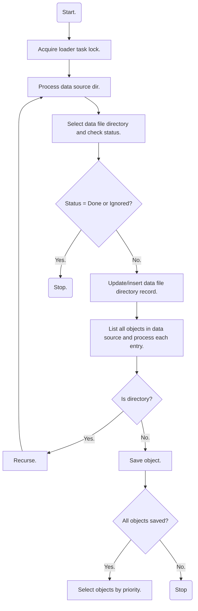

# Worker diagram

```mermaid
flowchart TD
    A(Start.) --> B1[Acquire loader task lock.]
    B1 --> C1[Process data source dir.]
    C1 --> C2[Select data file directory and check status.]
    C2 --> C3{Status = Done or Ignored?}
    C3 --> |No.| F1[Update/insert data file directory record.]
    C3 --> |Yes.| E1(Stop.)
    F1 --> F2[List all objects in data source and process each entry.]
    F2 --> G1{Is directory?}
    G1 --> |Yes.| H1[Recurse.]
    G1 --> |No.| I1[Save object.]
    H1 --> C1
    I1 --> J1{All objects saved?}
    J1 --> |Yes.| K1[Select objects by priority.]
    J1 --> |No.| L1(Stop)
```
