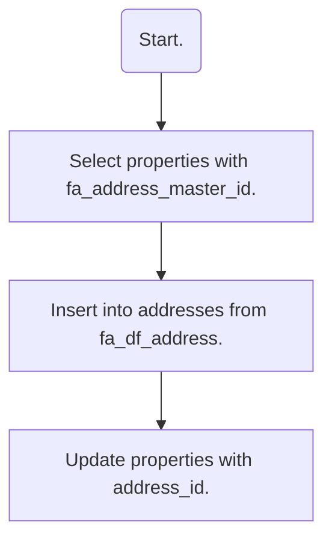
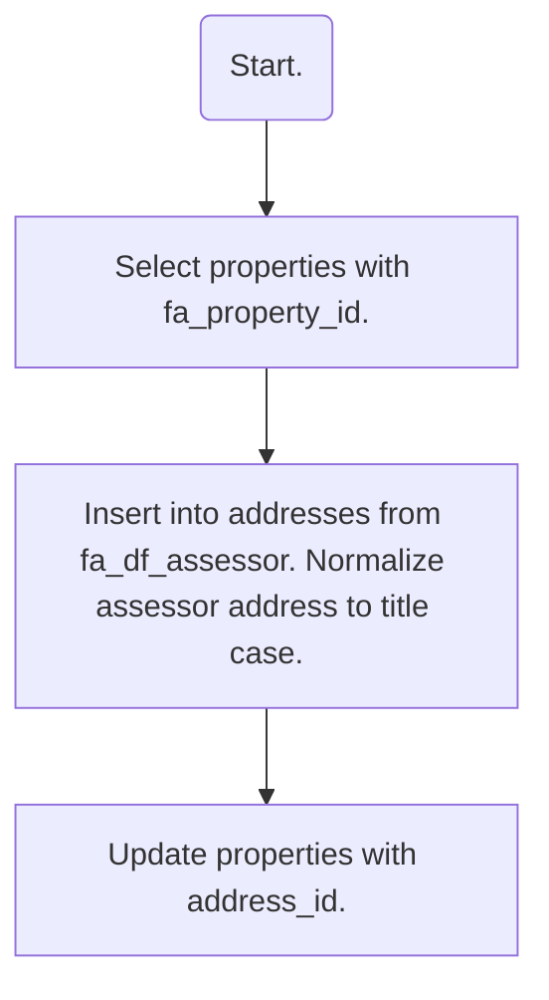

# Step 1 - Properties with fa_address_master_id

```mermaid
flowchart TD
    A(Start.) --> B1[Select properties with fa_address_master_id.]
    B1 --> C1[Insert into addresses from fa_df_address.]
    C1 --> D1[Update properties with address_id.]
```

# Step 2 - Properties with fa_property_id

```mermaid
flowchart TD
    A(Start.) --> B1[Select properties with fa_property_id.]
    B1 --> C1[Insert into addresses from fa_df_assessor. Normalize assessor address to title case.]
    C1 --> D1[Update properties with address_id.]
```
